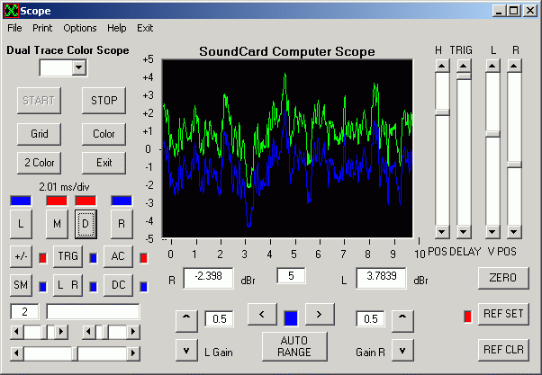



## Oscillator wave generator

### Description

A directx wave oscillator with five waveforms, (sine, saw, triangle, square, noise), great audio generator, may be used for a hearing test application (medical), all written on one form for easy intagration into any other application.
 
### More Info
 

             |
---                |---
**Submitted On**   |2008-08-29 03:48:12
**By**             |[scott93727](https://github.com/Planet-Source-Code/PSCIndex/blob/master/ByAuthor/scott93727.md)
**Level**          |Intermediate
**User Rating**    |4.7 (14 globes from 3 users)
**Compatibility**  |VB 3\.0, VB 4\.0 \(16\-bit\), VB 5\.0, VB 6\.0
**Category**       |[DirectX](https://github.com/Planet-Source-Code/PSCIndex/blob/master/ByCategory/directx__1-44.md)
**World**          |[Visual Basic](https://github.com/Planet-Source-Code/PSCIndex/blob/master/ByWorld/visual-basic.md)
**Archive File**   |[Oscillator2125148292008\.zip](https://github.com/Planet-Source-Code/scott93727-oscillator-wave-generator__1-71018/archive/master.zip)

